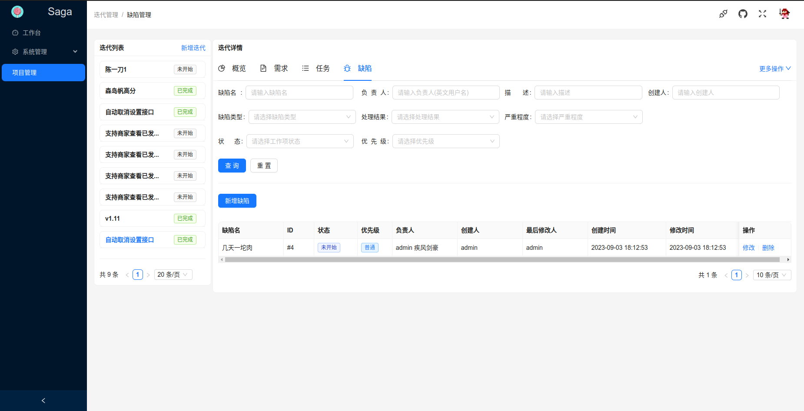

# saga

一站式项目管理平台，助力企业提升项目管理效能。

权限控制基于RBAC，精确到菜单和按钮级别权限控制。

## 预览



## 本地开发环境搭建
```shell
# cd到项目根目录，创建虚拟环境
python3 -m venv venv
source venv/bin/activate
pip3 install -i https://pypi.doubanio.com/simple -U pip setuptools
# 安装mysqlclient如果报错就去github仓库(https://github.com/PyMySQL/mysqlclient)查看readme文档查看如何安装缺失的相关依赖包
pip3 install -i https://pypi.doubanio.com/simple -r requirements.txt
#####################################################
###                     MySQL                     ###
#####################################################
# 使用docker快速启动一个MySQL8容器并设置密码为123456，并持久化数据到本地/home/hashqueue/mysqldatadir
docker run --name mysql8 -p 3306:3306 -v /home/hashqueue/mysqldatadir:/var/lib/mysql -e MYSQL_ROOT_PASSWORD=123456 -d mysql:8.0.30
# 连接到数据库中，执行以下SQL创建本地开发数据库
create database saga_dev;
# 进行数据迁移
ENV_PATH=.env.dev python3 manage.py makemigrations
# 开发环境默认会找项目根目录下的.env.dev环境变量文件，所以debug=True模式下可以省略`ENV_PATH=.env.dev`
python3 manage.py migrate
# 导入初始化数据
python3 manage.py loaddata init_db.json
#####################################################
###                     RabbitMQ                  ###
#####################################################
# 使用docker在本地快速启动一个rabbitmq服务器
# 15672：RabbitMQ 管理控制台端口，用于通过 Web 界面进行管理和监控 RabbitMQ 服务。
# 5672：RabbitMQ 的 AMQP 端口，用于客户端与 RabbitMQ 之间的通信。
# 1883：MQTT 协议的默认端口，RabbitMQ 也支持 MQTT 协议，并且可以通过该端口接收来自 MQTT 客户端的消息。
docker run -d --name ramq -p 5672:5672 -p 15672:15672 -p 1883:1883 -v /home/hashqueue/rabbitmq:/var/lib/rabbitmq rabbitmq:3.11-management-alpine
# 启动项目
python3 manage.py runserver 0.0.0.0:8000
# 启动celery worker
celery -A saga worker -Q saga_make_changelog_queue -l info --concurrency=1 --prefetch-multiplier=1 --hostname=worker_changelog@%h
celery -A saga worker -Q saga_send_email_queue -l info --concurrency=1 --prefetch-multiplier=1 --hostname=worker_email@%h

# 前端开发环境搭建见前端仓库 https://github.com/hashqueue/saga-web.git

#####################################################
###               Done!下边的命令了解即可            ###
#####################################################
# Django导出数据库数据
python3 manage.py dumpdata --format json --indent 2 -o init_db.json
# Django导入初始化数据到新的数据库中
python3 manage.py loaddata init_db.json
```

## 生产环境部署

1. 安装docker和docker-compose和git
    * [docker安装步骤(官方文档)](https://docs.docker.com/engine/install/)
    * [docker-compose安装步骤(官方文档)](https://docs.docker.com/compose/install/)
    * [git安装步骤(官方文档)](https://git-scm.com/download/linux)
2. git拉取本项目代码到服务器
    ```shell
    # 下载后端源码
    git clone https://github.com/hashqueue/saga.git
    cd saga
    # 下载前端源码
    git clone https://github.com/hashqueue/saga-web.git
    ```
3. docker-compose启动项目(前端，后端，数据库)
    ```shell
    # 启动项目前一定要去看一下.env.prod文件，根据自己的实际情况修改里边的配置项(重要!!!)
    # 部署并启动项目(取消-d参数可以查看启动日志，方便部署的时候调试。调试完毕后再加上-d参数后台部署)
    docker-compose --env-file=.env.prod up -d
    # 容器全部启动成功后，手动进入backend容器，初始化数据库数据(此步骤仅第一次部署项目时需要操作！！！)。
    docker exec -it backend bash # 进入backend容器
    ENV_PATH=.env.prod python3 manage.py loaddata init_db.json # 初始化数据库数据
    ```
项目部署成功后访问`http://服务器域名或IP/`即可跳转到登录页面
